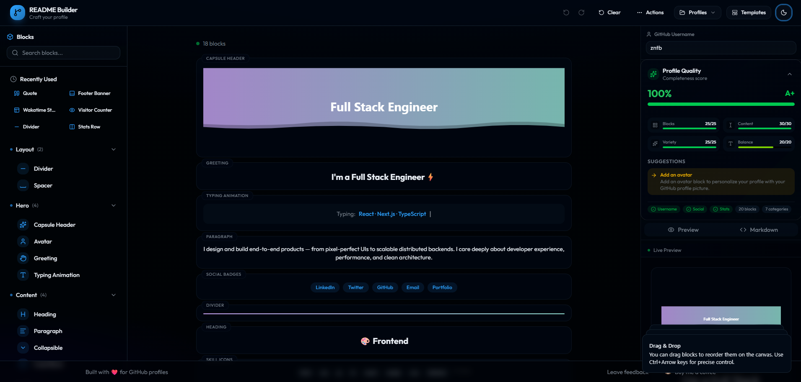

<div align="center">


<br/>

[](https://nextjs.org/)
[](https://react.dev/)
[](https://www.typescriptlang.org/)
[](https://tailwindcss.com/)
[](LICENSE)

<br/>

**[🚀 Live Demo](https://github-profile-maker.vercel.app/) · [📖 Documentation](docs/GETTING_STARTED.md) · [🐛 Report Bug](https://github.com/zntb/github-profile-maker/issues) · [✨ Request Feature](https://github.com/zntb/github-profile-maker/issues)**

</div>

---

## Overview

**GitHub Profile Maker** is a fully visual, drag-and-drop editor for creating beautiful GitHub profile `README.md` files — zero code required. Pick from a rich library of blocks, configure them with an intuitive panel, preview the result in real time, and export production-ready Markdown in one click.

> Built with **Next.js 16**, **React 19**, **TypeScript**, **Tailwind CSS v4**, **shadcn/ui**, **Zustand**, and **dnd-kit**.

<div align="center">
  
</div>

---

## Table of Contents

- [Overview](#overview)
- [Table of Contents](#table-of-contents)
- [Features](#features)
- [Tech Stack](#tech-stack)
- [Quick Start](#quick-start)
  - [Prerequisites](#prerequisites)
  - [Installation](#installation)
  - [Environment Variables](#environment-variables)
  - [Run the App](#run-the-app)
- [Templates](#templates)
- [Documentation](#documentation)
- [License](#license)

---

## Features

| Feature                       | Description                                                           |
| ----------------------------- | --------------------------------------------------------------------- |
| 🧱 **Drag & Drop Canvas**     | Reorder blocks effortlessly with smooth dnd-kit animations            |
| 🔒 **Block Locking**          | Lock blocks to prevent accidental modifications and reordering        |
| 📐 **Stats Row Layout**       | Flexible row/column multi-card layouts for stats widgets              |
| 👁️ **Live Preview**           | See exactly how your README renders in GitHub's style                 |
| 📝 **Markdown Export**        | Copy to clipboard or download a ready-to-use `README.md`              |
| 🎨 **65+ Themes**             | Tokyo Night, Dracula, Radical, Catppuccin, and many more              |
| 🎨 **Live Theme Preview**     | Real-time theme colors shown in canvas when selecting themes          |
| 📦 **25+ Block Types**        | Headers, stats cards, badges, skill icons, graphs, and more           |
| 🖼️ **Template Library**       | 11 ready-to-use templates for different developer profiles            |
| 📱 **Fully Responsive**       | Optimized three-layout system for desktop, tablet, and mobile         |
| 🌙 **Dark / Light Mode**      | System-aware theming powered by `next-themes`                         |
| ⚡ **Self-hosted Stats**      | Built-in Next.js API routes generate GitHub stat SVGs server-side     |
| 🔑 **GitHub GraphQL**         | Optional `GITHUB_TOKEN` for real, live stats from the GitHub API      |
| 💬 **Random Quotes**          | Built-in API for fetching random developer quotes                     |
| 💾 **Auto-Save with History** | Automatic progress saving with undo/redo (last 20 states)             |
| 💼 **Save & Load Profiles**   | Save multiple profiles locally, switch between configurations         |
| 🔍 **Profile Quality Score**  | Real-time profile completeness analysis with improvement suggestions  |
| 🔍 **Block Tooltips**         | Hover previews with descriptions for easy block discovery             |
| ⌨️ **Keyboard Shortcuts**     | Navigate, add, reorder, and configure blocks without mouse            |
| ⌘ **Command Palette**         | Ctrl+K / Cmd+K for quick access to all actions, blocks, and templates |
| 💡 **Smart Notifications**    | Context-aware hints that appear based on your actions                 |
| ⚡ **Progressive Loading**    | Skeleton loaders show while data and blocks are loading               |
| 🚀 **Lazy Block Rendering**   | Virtualized canvas for smooth performance with 20+ blocks             |
| ☁️ **Save to GitHub Gist**    | One-click backup to public or private GitHub Gists                    |

---

## Tech Stack

```text
Frontend          Next.js 16 (App Router) · React 19 · TypeScript 5
Styling           Tailwind CSS v4 · tw-animate-css · shadcn/ui (radix-nova)
State             Zustand 5
Drag & Drop       dnd-kit (sortable)
Virtualization    react-window · react-virtualized-auto-sizer
Icons             Lucide React
Theming           next-themes
Notifications     Sonner
API               Next.js Route Handlers · GitHub REST & GraphQL APIs
Fonts             Outfit · JetBrains Mono
```

---

## Quick Start

### Prerequisites

- **Node.js** ≥ 18
- A package manager: `npm`, `pnpm`, `yarn`, or `bun`
- _(Optional)_ A GitHub Personal Access Token for live stats

### Installation

```bash
# 1. Clone the repository
git clone https://github.com/zntb/github-profile-maker.git
cd github-profile-maker

# 2. Install dependencies
npm install

# 3. Copy environment variables
cp .env.example .env.local
```

### Environment Variables

```env
# .env.local

# Optional – enables real GitHub stats, streak, trophies, and activity graphs.
# Create one at: https://github.com/settings/tokens
# Required scopes: read:user
GITHUB_TOKEN=ghp_xxxxxxxxxxxxxxxxxxxx
```

> **Without a token** the stat widgets still render but display a "GitHub Token Required" placeholder instead of live data.

### Run the App

```bash
npm run dev
```

Open [http://localhost:3000](http://localhost:3000) in your browser.

---

## Templates

Eleven built-in templates are included to help you start quickly:

| Template                   | Description                                                     | Blocks |
| -------------------------- | --------------------------------------------------------------- | ------ |
| **Animated Developer**     | Waving header, typing SVG, full stats suite, social badges      | 16     |
| **Minimal Clean**          | Simple heading/paragraph layout with essential stats            | 8      |
| **Stats Focused**          | Full stats dashboard — card, streak, languages, graph, trophies | 8      |
| **Creative Profile**       | Avatar, custom animation, quote block, creative color palette   | 9      |
| **Open Source Maintainer** | Container layout, collapsible sections, extensive stats         | 18     |
| **Full Stack Engineer**    | Multiple skill icon sections, comprehensive stats               | 19     |
| **Data Scientist / ML**    | Code blocks, ML frameworks, visualizations                      | 20     |
| **DevOps / Cloud**         | Custom badges, code blocks, cloud platforms                     | 21     |
| **Student / Beginner**     | Learning focus with beginner-friendly content                   | 21     |
| **Cybersecurity**          | Code-focused, custom badges, security tools                     | 17     |
| **Game Developer**         | Gaming-focused with custom badges and quote block               | 22     |

Templates are defined in `lib/templates.ts` and can be extended freely.

---

## Documentation

For detailed documentation, see the `docs` folder:

| Document                                        | Description                                                          |
| ----------------------------------------------- | -------------------------------------------------------------------- |
| [GETTING_STARTED.md](docs/GETTING_STARTED.md)   | User guide with interface overview, block usage, and troubleshooting |
| [API_REFERENCE.md](docs/API_REFERENCE.md)       | API endpoints for stats, streaks, languages, activity, and trophies  |
| [BLOCKS_REFERENCE.md](docs/BLOCKS_REFERENCE.md) | Complete reference for all 26+ block types and their configurations  |
| [DEVELOPMENT.md](docs/DEVELOPMENT.md)           | Developer guide for contributing and extending the project           |
| [THEMES.md](docs/THEMES.md)                     | Theme customization guide with 65+ available themes                  |

---

## License

This project is licensed under the **MIT License** — see the [LICENSE](LICENSE) file for details.

---

<div align="center">


Made with ❤️ using Next.js & React

⭐ **Star this repo** if you found it useful!\
<br/>

[](https://buymeacoffee.com/codetibo)

</div>

---
